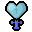
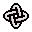
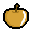
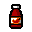

# TBOOOP! A demake of The Binding of Isaac

  

### About
A demake of 'The Binding of Isaac', created as a project for the Object-Oriented Programming course (2023/24).
#### Authors:
- [@GioeleBucci](https://github.com/GioeleBucci)
- [@edoardoceresi](https://github.com/edoardoceresi)
- [@N1c0zz](https://github.com/N1c0zz)
- [@SimoneM-17](https://github.com/SimoneM-17)

[Sprites](https://www.reddit.com/r/themoddingofisaac/comments/77cvk5/free_assets_roomsbossesmusic_and_more/) by [CakeReddit](https://www.reddit.com/user/CakeReddit/)

### Commands
- **Move**: `W` `A` `S` `D`
- **Attack**: `↑` `←` `↓` `→`
- **Resize**: `P` `M`

### Items & Prices

    <table>
        <tr>
            <td>
                
            </td>
            <td>
                <b>Zap (10¢)</b> 
                <i>Speed Up</i>
            </td>
            <td>
                
            </td>
            <td>
                <b>Glass Heart (15¢)</b> 
                <i>Full Health</i>
            </td>
        </tr>
        <tr>
            <td>
                
            </td>
            <td>
                <b>Locked Rings (15¢)</b> 
                <i>Damage Up</i>
            </td>
            <td>
                
            </td>
            <td>
                <b>Golden Apple (15¢)</b> 
                <i>Max Health Up</i>
            </td>
        </tr>
        <tr>
            <td>
                
            </td>
            <td>
                <b>Spicy Sauce (20¢)</b> 
                <i>Shot Speed Up</i>
            </td>
            <td></td>
            <td></td>
        </tr>
    </table>

### Screenshots

